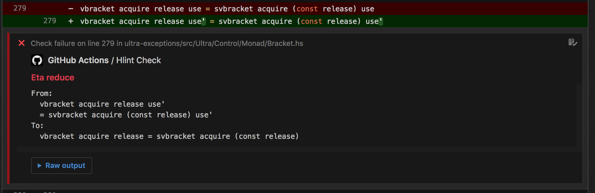

An action that runs `hlint` checks over Haskell code.

If there are errors found in the Haskell code then the action will fail.

Example workflow:

```
workflow "Code Checks" {
  on = "push"
  resolves = ["haskell-lint"]
}

action "haskell-lint" {
  uses = "domdere/haskell-lint-action@master"
}
```

It will insert inline suggestions into the PR:



## TODOs

- [x] Opens proper GitHub check runs
- [x] Annotates lines in PR with suggestions
- [ ] Support `hlint.yaml` in repos
- [ ] Support `hlint.yaml` by reference (from S3/GitHub/etc...)
